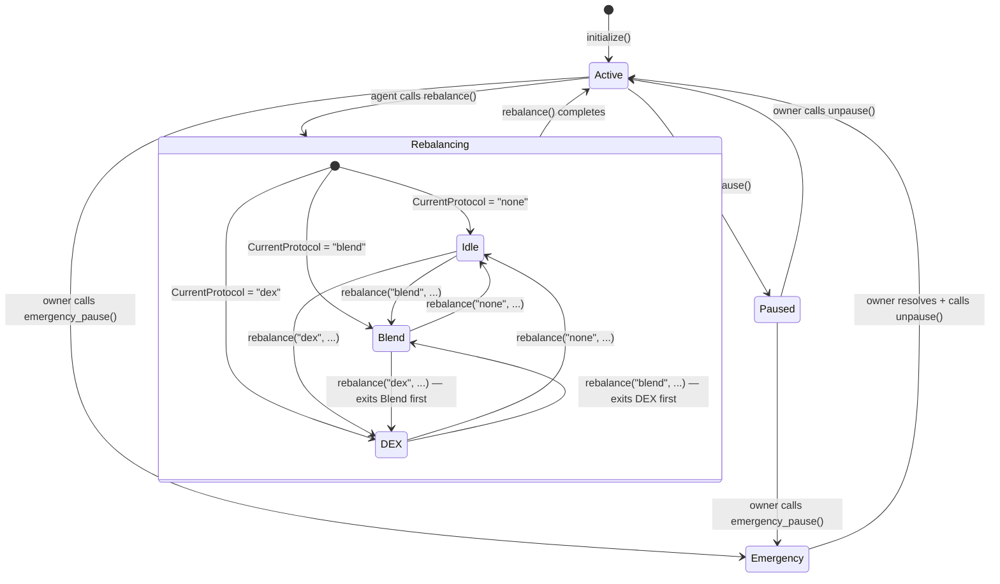

# NeuroWealth Vault — Protocol State Machine

This document describes the lifecycle of the NeuroWealth Vault smart contract,
including all states, transitions, and the actions restricted in each state.

---

## State Diagram

---

## State Transition Table

| From        | To          | Trigger                        | Who     | Precondition                              | Restricted During Transition         |
|-------------|-------------|-------------------------------|---------|-------------------------------------------|--------------------------------------|
| `Active`    | `Paused`    | `pause()`                     | Owner   | Vault not already paused                  | Deposits, withdrawals blocked after  |
| `Paused`    | `Active`    | `unpause()`                   | Owner   | Vault is paused                           | —                                    |
| `Active`    | `Rebalancing` | `rebalance()`               | Agent   | Not paused; cooldown elapsed              | None (vault accepts deposits during) |
| `Rebalancing` | `Active`  | `rebalance()` returns         | Agent   | Automatic on function return              | —                                    |
| `Active`    | `Emergency` | `emergency_pause()`           | Owner   | Vault not already in emergency            | Deposits, withdrawals blocked after  |
| `Paused`    | `Emergency` | `emergency_pause()`           | Owner   | Vault is paused (re-sets same flag)       | —                                    |
| `Emergency` | `Active`    | owner resolves + `unpause()`  | Owner   | Emergency condition manually cleared      | —                                    |

---

## Per-State Description

### Active

Normal operating state. The vault accepts deposits and processes withdrawals.
Funds may be held directly in the vault or deployed via an external protocol
(Blend or a DEX). The share price is updated via `update_total_assets()`.

**Who can trigger entry:** `initialize()` (deployer), `unpause()` (owner).

**Preconditions:**
- `DataKey::Paused` is either absent or `false`.
- `DataKey::CurrentProtocol` may be `"blend"`, `"dex"`, or `"none"`.

**DEX sub-state:** When `CurrentProtocol == "dex"` the vault's USDC is
deployed to a configured DEX liquidity pool. Rebalancing to `"blend"` or
`"none"` exits the DEX position first (remove_liquidity), then enters the
target protocol. A failed DEX exit leaves `CurrentProtocol` unchanged.

**Blocked actions:** None — all user and admin operations available.

---

### Paused

The owner has halted normal operations. No deposits or withdrawals are processed.
Triggered by `pause()` (error code for unauthorized caller: `OnlyOwnerCanPause = 19`).

**Who can trigger entry:** Owner via `pause()`.

**Preconditions:** Vault must be in `Active` state.

**Blocked actions:**
- `deposit()` — reverts with `Error(Contract, #35)`
- `withdraw()` — reverts with `Error(Contract, #35)`
- `withdraw_all()` — reverts with `Error(Contract, #35)`

**Admin actions still allowed:** `unpause()`, `set_tvl_cap()`, `set_owner()`, `upgrade()`.

---

### Rebalancing

An implicit transient state during execution of `rebalance()`. The agent is moving
funds between protocols (e.g., Blend → Vault or Vault → DEX). There is no
explicit storage flag for this state; it is bounded by the single Soroban
transaction that runs `rebalance()`.

**Who can trigger entry:** Agent via `rebalance()`.

**Preconditions:**
- Vault must be in `Active` state (not paused).
- Current ledger ≥ `LastRebalanceLedger + MinRebalanceInterval` (cooldown enforced).

**Blocked actions:**
- None — Soroban's single-threaded execution model means no concurrent
  state mutation is possible during the transaction.

**Note:** Calling `rebalance()` before the cooldown period has elapsed is
rejected. The cooldown is tracked via `DataKey::LastRebalanceLedger` and
`DataKey::MinRebalanceInterval`.

---

### Emergency

A distinct pause mode triggered by `emergency_pause()` when the owner detects
an abnormal condition requiring immediate fund protection. Separate from the
regular `pause()` path; unauthorized callers receive
`OnlyOwnerCanEmergencyPause = 22`.

**Who can trigger entry:** Owner via `emergency_pause()`.

**Preconditions:** Vault is in `Active` or `Paused` state.

**Blocked actions:**
- `deposit()` — reverts with `Error(Contract, #35)`
- `withdraw()` — reverts with `Error(Contract, #35)`
- `withdraw_all()` — reverts with `Error(Contract, #35)`
- `rebalance()` — blocked while paused

**Resolution path:** Owner investigates the incident, applies any needed
remediation (off-chain or via upgrade), then calls `unpause()` to return
the vault to `Active`.

> **Implementation note:** Paused and Emergency states share the same on-chain
> storage flag (`DataKey::Paused = true`). Off-chain systems cannot distinguish
> between a regular pause and an emergency pause by inspecting storage alone —
> they must check emitted event topics (`"pause"` vs `"emergency_pause"`) to
> determine which path was taken.

---

## Storage Keys Referenced

| Key                       | Type     | Description                                  |
|---------------------------|----------|----------------------------------------------|
| `DataKey::Paused`         | `bool`   | `true` while vault is paused                 |
| `DataKey::CurrentProtocol`| `Symbol` | Active deployment target: `"blend"` / `"dex"` / `"none"` |
| `DataKey::LastRebalanceLedger` | `u32` | Ledger sequence of last rebalance           |
| `DataKey::MinRebalanceInterval` | `u32` | Minimum ledgers between rebalances         |
| `DataKey::TvLCap`         | `i128`   | Maximum TotalAssets the vault will accept    |
| `DataKey::DexPool`        | `Address`| Configured DEX liquidity pool address (optional) |
| `DataKey::ApprovalTtl`    | `u32`    | Ledgers added to current sequence for DEX token approvals |
